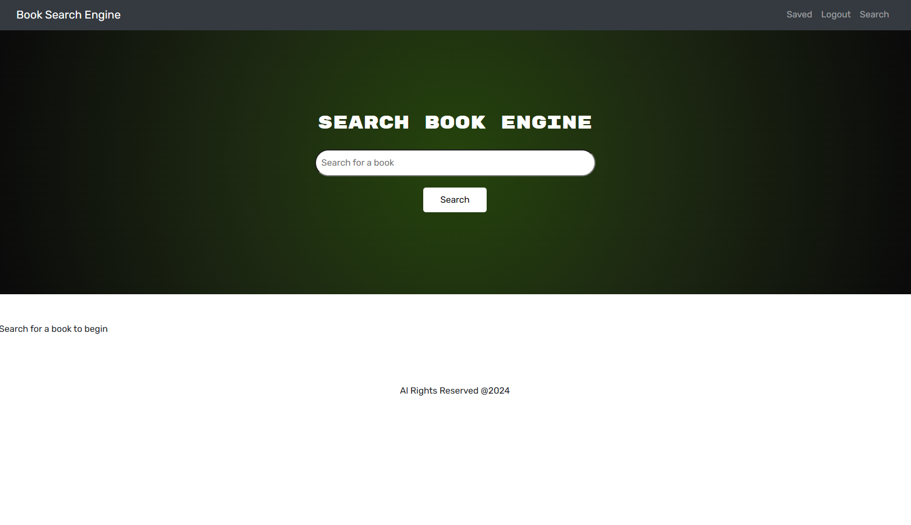

# Google Book Search 
##live link
https://m21mern.herokuapp.com/

## Summary
the creation of an Apollo Server Graql API using the Google Books API. The MERN stack is used in the app's development. Users can create an account, log in, conduct a search for books, and save those books to a list of favourites. The saved books can also be removed from the list by users.

## Tools Used

* Node.js
* Express
* JavaScript
* React
* Graphql
* Dotenv
* Apollo Server
* Mongoose
* Heroku
* Mongodb

# Snapshot

[]

# Installation & Database SetUp
To use this app, you must run npm init to build your package.json file.
* The programme requires the installation of the following Npm dependencies in order to function properly: The required dependencies are contained in the package.json file.
* To install the database properly, you must create a cluster on Mongodb Atlas.

To make the port accessible to Mongoose, run "npm start". This programme is configured for Heroku.

# Contributing
​Contributors: N/A

# Tests
N/A

